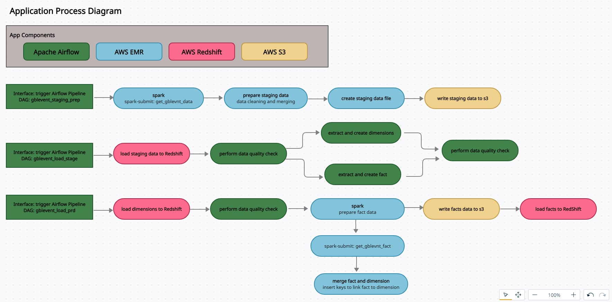
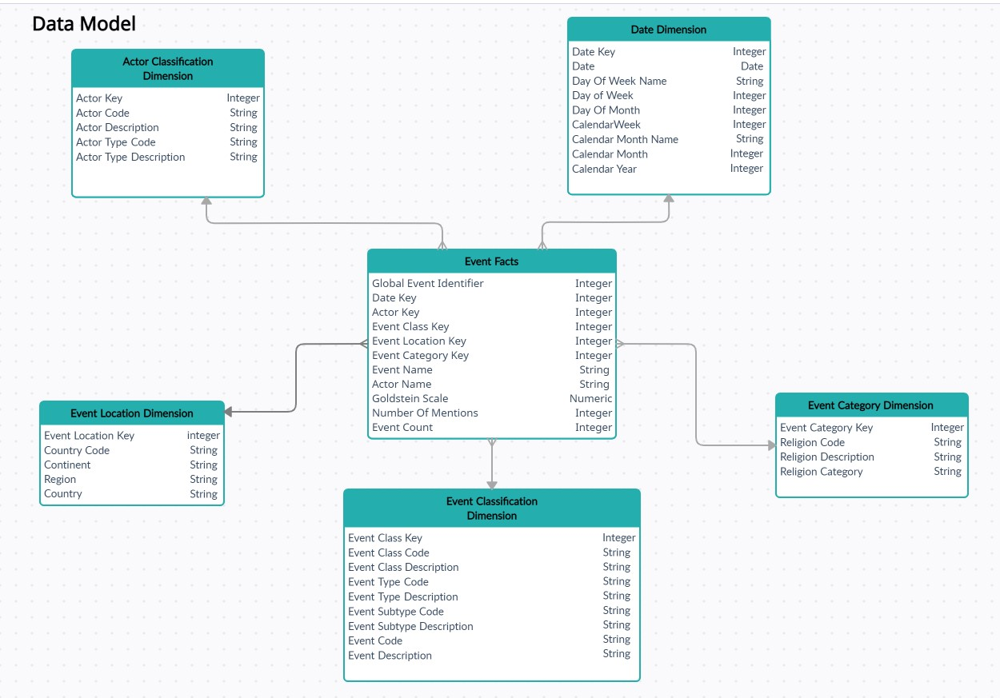
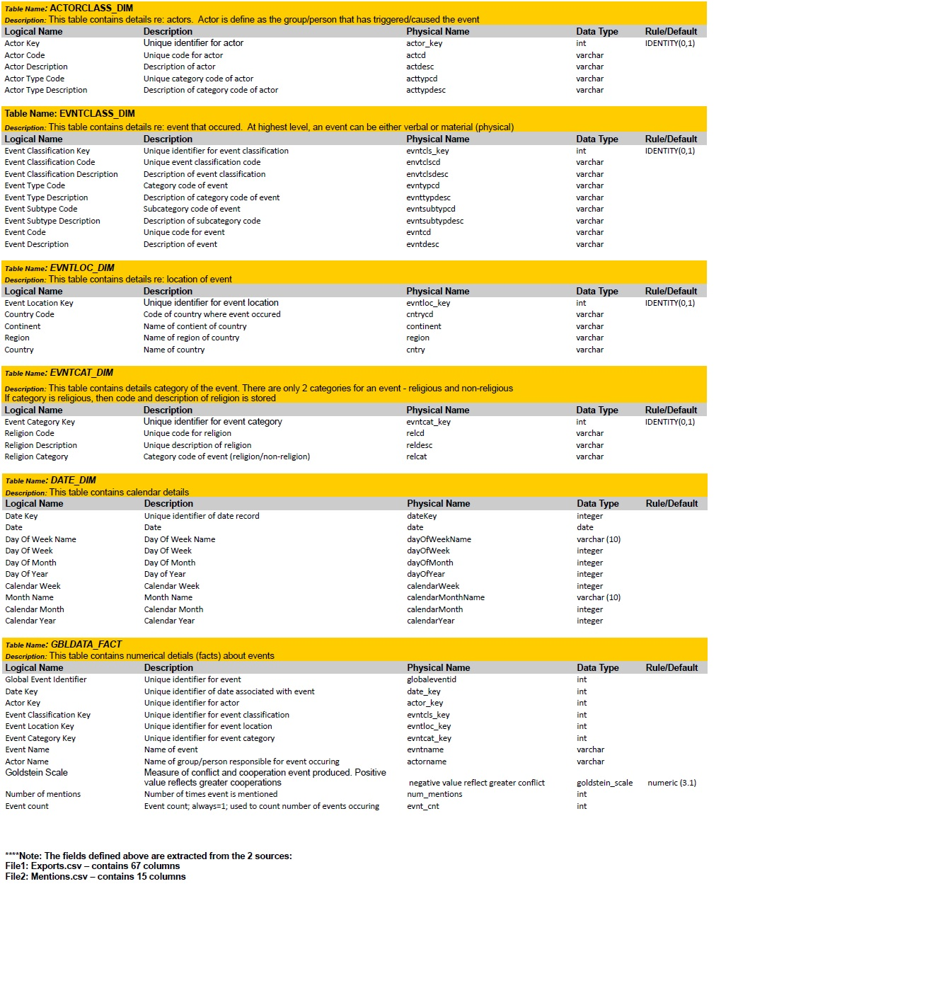

# NANODEGREE - DATA ENGINEERING 
# CAPSTONE PROJECT | Ed Flemister

## Data Processing Application of Global Event Data based on the GDELT Project using Apache Airflow, Spark (AWS EMR) and AWS Redshift 

### Project Overview
This project uses Apache Airflow for orchestration along Spark (AWS EMR) to process data which is then stored in AWS Redshift. The project uses data generated by the GDELT Project to determine the stability of different regions around the world. 

### Background
GDELT monitors print, broadcast, and web news media in over 100 languages from across every country in the world to keep continually updated on breaking developments anywhere on the planet.  Details of each event like (location, type, etc) is captured and given a rating known as the Goldstein scale.  This rating is then used to determine the stability of the location.

### Project Goal
The goal of the project is to provide statistics such as the number of events that occurred over a given period, the types of events and a comparison of the stability of different locations based on the Goldstein scale. 
In order to support the end goal of querying, analyzing, and reporting aggregated statistics, a dimensional model consisting of fact and dimension tables has been implimented.

### App Architecture

### Data Model

### Data Dictionary

### Setup

_**Assumptions**_:
 - Implimenter is familiar with AWS and has created AWS account (Access Key/Secret)
 - .pem allowing access to EC2 instance has been created. Note: in the setup instructions, replace any reference to [your_pem_file.pem] with the actual name of your .pem file
 
* **App Env/Directory Structure Setup**
   - Instructions for App Setup can be found here: setup/application_file_setup.txt
* **Launch/Setup AWS EMR Cluster** 
   - Instructions for EMR Cluster Setup can be found here: setup/emr_setup.txt
* **Launch/Setup AWS Redshift Cluster**
   - Instructions for Redshift Cluster Setup can be found here: setup/redshift_setup.txt
* **Setup/Configure Apache Airflow** 
   - Instructions for Airflow Setup can be found here: setup/airflow_setup.txt

### Additional Comments
* Source data is stored in S3 
    - s3://dataeng-capstone/articles/
    - s3://dataeng-capstone/events/
    - s3://dataeng-capstone/dimensions/

* Data files generated by process are also stored in S3
    - s3://dataeng-capstone-stgevents/stagevnt_table.csv/
    - s3://dataeng-capstone-stgevents/stagevnt_table_bak.csv/
    - s3://dataeng-capstone-gbldata/gbldata_fact.csv/

### Application Execution

#### Dataset
The size of the dataset is approx 5GB. The dataset holds one month of data (Jan, 2019).  
However, files are processed on a daily bases.  To control which days are processed, modify 
the start and end dates in the gblevent.cfg file.  The process is currently set to process the 1st 
fourteen days of the month.
 
#### Execution
Once setup is complete, launch Airflow to run the dags.  Currently there are 3 dags (but plan is to
consolidate to one dag only).  The dags are:
 - aer_gblevnt_staging_prep
 - aer_gblevent_load_stage
 - aer_gblevent_load_prd
 
 Step 1 - Trigger aer_gblevnt_staging_prep.  Since this is a back fill process, you only need to unpause the dag in 
          Airflow and it will start automatically
  
 Step 2 - Once aer_gblevnt_staging_prep dag is complete, manually start aer_gblevent_load_stage dag.
 
 Step 3 - Once aer_gblevent_load_stage dag is complete, manually start aer_gblevent_load_prd dag.
 
 #### DAG Description
 - aer_gblevnt_staging_prep: this dag performs data wrangling and uses Spark to read and merge the source data (events, mentions, dimension lookups)
 from S3 and create and store a staging file on S3
 
 - aer_gblevent_load_stage: this dag will load the staging file to the staging schema on Redshift and create fact and
 dimension tables from the staging file
  
 - aer_gblevent_load_prd: this dag will load the production schema from the staging schema in Redshift.  It uses Spark to perform data wrangling and 
 to create a facts file from staging which is stored in S3, then reads that file to update production schema.  The final fact table contains key values for each dimension.
 
### Additional Scenarios

*Data Increase by 100%*

Current dataset is approximately 5gb and takes approximately 10-15 minutes total to execute all 3 dags. 

The current setup would likely not scale to 500gb. Spark is currently running with 1 master and two slaves so more slave nodes would be required to optimized for ram.

I would also consider parallelizing the executiion of the pipeline for each day.

*Pipeline Ran On A Daily Basic at 7am*

The pipeline is currently configured to run daily a 7am.
Additional logic would need to be added to check that the data is available prior to start of processing 

*Database Access To 100+ people*

Storing the data (facts and dimensions) on Redshift cluster resolves the concern for given access to 100+ people.
A couple of items to consider as the volume of data increase in Redshift:

- Compress Data In S3.  The benifits of doing this are:
    - Faster file upload to S3
    - Lower S3 storage utilization (cost)
    - Faster load process because uncompression can happen as the file is read.
    
- Use Columnar Formats such as parquet for S3 data.  The benifit for doing this is: 
    - Columnar formats deliver better performance when processing as compared to row-based formats.