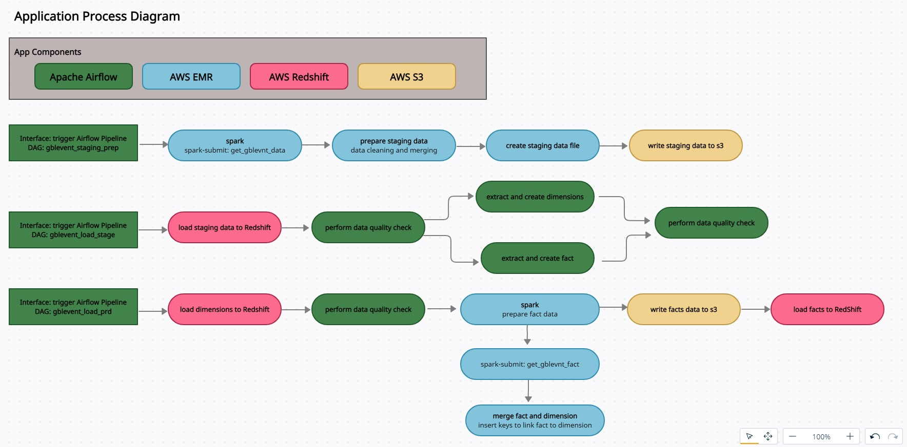
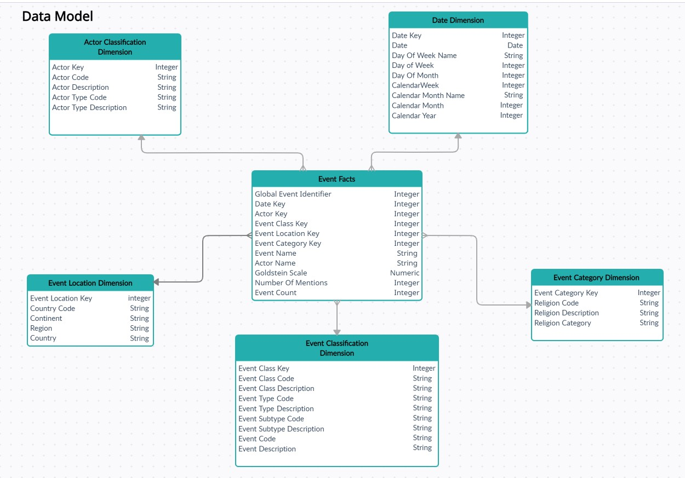

# NANODEGREE - DATA ENGINEERING 
# CAPSTONE PROJECT | Ed Flemister

## Data Processing Application of Global Event Data based on the GDELT Project using Apache Airflow, Spark (AWS EMR) and AWS Redshift 

### Project Overview
This project uses Apache Airflow for orchestration along Spark (AWS EMR) to process data which is then stored in AWS Redshift. The project uses data generated by the GDELT Project to determine the stability of different regions around the world. 

### Background
GDELT monitors print, broadcast, and web news media in over 100 languages from across every country in the world to keep continually updated on breaking developments anywhere on the planet.  Details of each event like (location, type, etc) is captured and given a rating known as the Goldstein scale.  This rating is then used to determine the stability of the location.

### Project Goal
The goal of the project is to provide statistics such as the number of events that occurred over a given period, the types of events and a comparison of stability of different locations based on the Goldstein scale. 

### App Architecture

### Data Model

### Data Dictionary

### Setup
* App Env/Directory Structure Setup
   - Instructions for App Setup can be found here: setup/application_file_setup.txt
* Launch/Setup AWS EMR Cluster 
   - Instructions for EMR Cluster Setup can be found here: setup/emr_setup.txt
* Launch/Setup AWS Redshift Cluster
   - Instructions for Redshift Cluster Setup can be found here: setup/redshift_setup.txt
* Setup/Configure Apache Airflow 
   - Instructions for Airflow Setup can be found here: setup/airflow_setup.txt

### Additional Comments
* Source data is stored in S3 
    - s3://dataeng-capstone/articles/
    - s3://dataeng-capstone/events/
    - s3://dataeng-capstone/dimensions/

* Data files generated by process are also stored in S3
    - s3://dataeng-capstone-stgevents/stagevnt_table.csv/
    - s3://dataeng-capstone-stgevents/stagevnt_table_bak.csv/
    - s3://dataeng-capstone-gbldata/gbldata_fact.csv/

### Application Execution

* Dataset
The size of the dataset is approx. 5GB. The dataset holds on month of data (Jan, 2019).  
However, files are processed on a daily bases.  To control which days are processed, modify 
the start and end dates in the gblevent.cfg file.  The process is currently set process the 1st 
fourteen days.
 
* Execution
Once setup is complete, launch Airflow to run the dags.  Currently there are 3 dags (but plan is to
consolidate to one dag only).  The dags are:
 - aer_gblevnt_staging_prep
 - aer_gblevent_load_stage
 - aer_gblevent_load_prd
 
 1) First, trigger aer_gblevnt_staging_prep.  Since this is a back fill process, you only need to unpause the dag in 
    Airflow and it will start automatically
  
 2) Once aer_gblevnt_staging_prep dag is complete, manually start aer_gblevent_load_stage dag.
 
 3) Once aer_gblevent_load_stage dag is complete, manually start aer_gblevent_load_prd dag.
 
 * DAG Description
 - aer_gblevnt_staging_prep: this dag will use Spark to read and merge the source data (events, mentions, dimension lookups)
 from S3 and create and store a staging file on S3
 
 - aer_gblevent_load_stage: this dag will load the staging file to the staging schema on Redshift and create fact and
 dimension tables from the staging file
  
 - aer_gblevent_load_prd: this dag will load the production schema from the staging schema in Redshift.  It uses Spark
 to create a facts file from staging which is stored in S3, then reads that file to update production schema.
 
### Additional Scenarios

*Data Increase by 100%*

Current dataset is approximately 7gb and takes approximately 10-15 minutes to complete. 

The current setup would not scale to 700gb. Currently running with 1 master and two slaves so would require more slave nodes, optimized for ram.

The data set could also not be loaded in one step. Instead I would parralelize executing the pipeline for each month of data on average 58gb, or even divide further into each two week tranch of data. Executed on a large enough cluster the pipeline could scale to 700gb.

*Pipeline Ran On A Daily Basic at 7am*

Only change required would be configuring the dag to run daily, not monthly.
Would also have to create some sort of API to sync the daily immigration data to the EMR master node
Date of datasets would also have to be included in the project directory

*Database Access To 100+ people*

The /mnt1/ directory can be considered the database, with the API being spark sql.
For each person, their IPs would be need to be whitelisted for the master node and I would create a python script that remotely reads the data from the emr directory on the master node.
Alternatively as a final step the data could be pushed to s3 post analyis with their IPs whitelisted to read the s3 bucket (which is better).
Final alternative is to introduce redshift, load the data from EMR master to redshift & whitelist them to execute sql against the redshift database.
